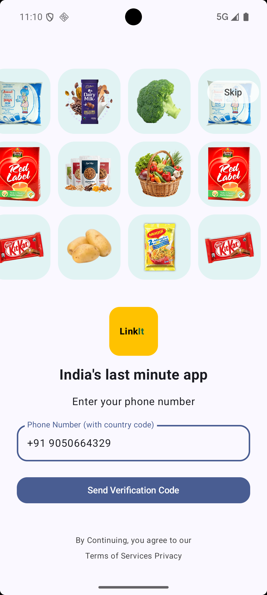
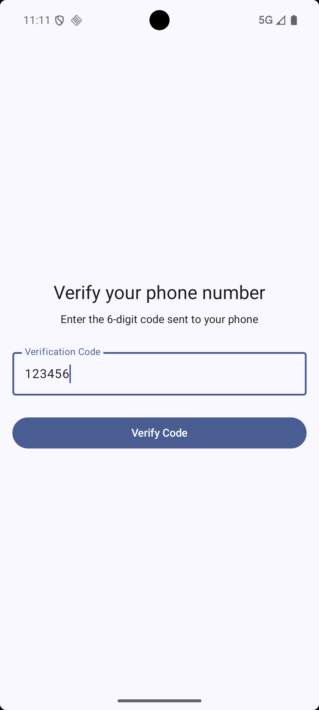
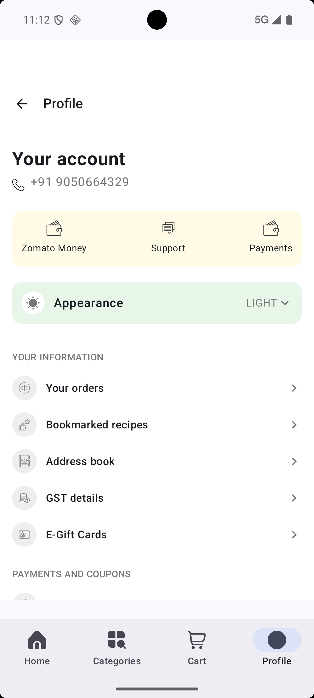
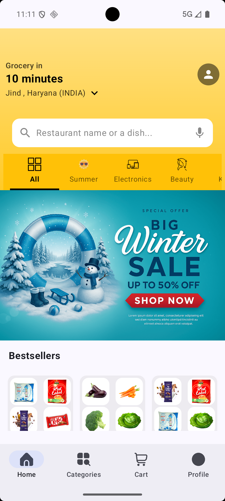
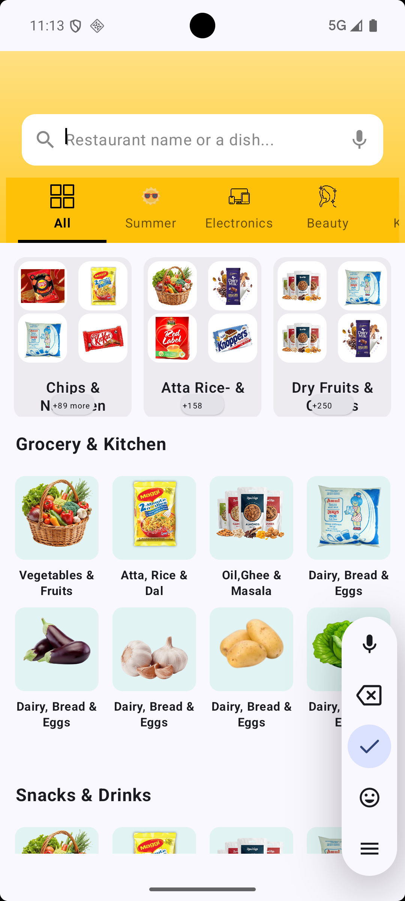
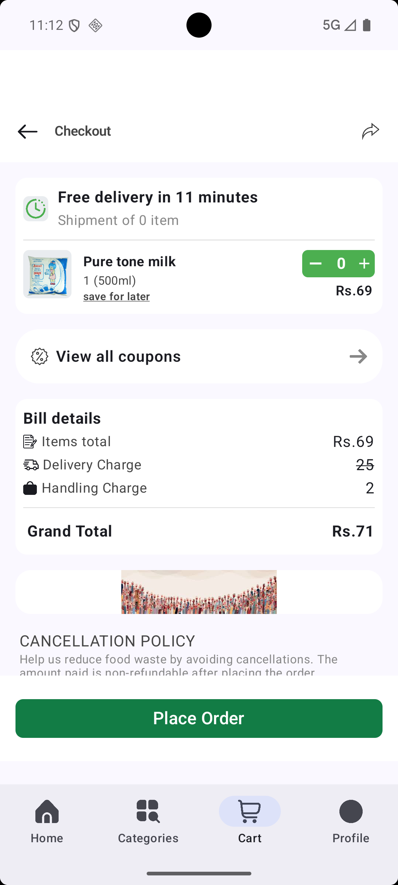

# 🛒 Grocery App

A modern Android grocery shopping application built with **Kotlin** and **Jetpack Compose**, featuring real-time Firebase integration for a seamless shopping experience.

## ✨ Features

- 🔐 **User Authentication** - Secure login and registration with Firebase Authentication
- 📱 **Modern UI** - Built entirely with Jetpack Compose for a smooth, responsive interface
- 🏪 **Product Browsing** - Browse groceries organized by categories
- 🛒 **Shopping Cart** - Add, remove, and manage items in your cart
- 👤 **User Profile** - Manage user information and preferences
- 🔍 **Search & Filter** - Easily find products by category
- 💳 **Order Management** - Track your orders and purchase history
- 🎨 **Beautiful Animations** - Smooth transitions and Lottie animations throughout the app
- 🔴 **Real-time Updates** - Firebase Realtime Database integration for live data sync

## 🛠️ Tech Stack

- **Language**: Kotlin
- **UI Framework**: Jetpack Compose
- **Backend**: Firebase (Authentication & Realtime Database)
- **Dependency Injection**: Hilt
- **Navigation**: Jetpack Navigation Compose
- **Image Loading**: Coil
- **Animations**: Lottie Animations
- **Serialization**: Kotlinx Serialization
- **Build System**: Gradle KTS
- **Min SDK**: 24 | Target SDK: 36

##  📝 Architecture
This app follows MVVM (Model-View-ViewModel) architecture with the following layers:

- UI Layer: Compose screens and components
- ViewModel Layer: Business logic and state management
- Data Layer: Firebase integration and data models
- Navigation Layer: Jetpack Navigation Compose


## 📸 Screenshots

| Registration Screen | Verification Screen | User Profile |
|---|---|---|
|  |  | 


| Home Screen | Category Screen | Cart |
|---|---|---|
|  |  | 


## 🚀 Getting Started

### Prerequisites
- Android Studio (Latest version)
- Kotlin 1.9+
- Min SDK: 24
- Target SDK: 36

### 🚀 Installation

1. **Clone the repository**

```bash
git clone https://github.com/Ashusingla90/Grocery_app.git
cd Grocery_app
```

2. **Open in Android Studio**

* Launch Android Studio
* Select **"Open an Existing Project"**
* Navigate to the cloned repository

3. **Build and Run**

* Sync Gradle files (**File → Sync Now**)
* Connect an Android device or use an emulator
* Click **Run** (or press `Shift + F10`)

---

### 🔥 Firebase Setup

1. Create a Firebase project at [Firebase Console](https://console.firebase.google.com/)
2. Add an Android app to your Firebase project
3. Download `google-services.json` and place it in the `app/` directory
4. Enable Authentication (Email/Password & Google Sign-In)
5. Enable Realtime Database


## 🤝 Contributing
Contributions are welcome! Here's how you can help:

- 1). Fork the repository
- 2). Create a feature branch (`git checkout -b feature/AmazingFeature`)
- 3). Commit your changes (`git commit -m 'Add some AmazingFeature'`)
- 4). Push to the branch (`git push origin feature/AmazingFeature`)
- 5). Open a Pull Request
